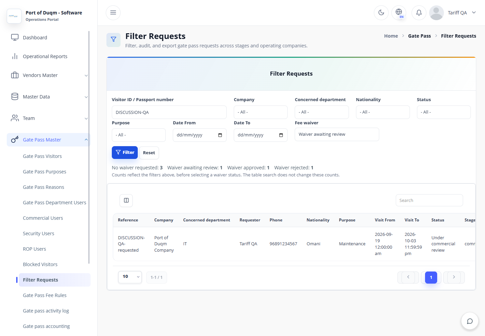
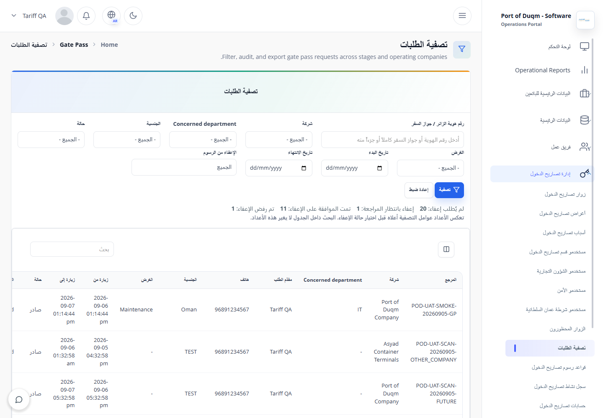
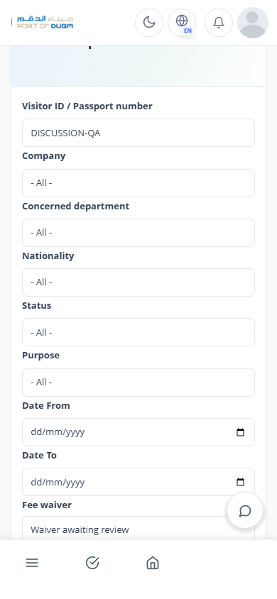
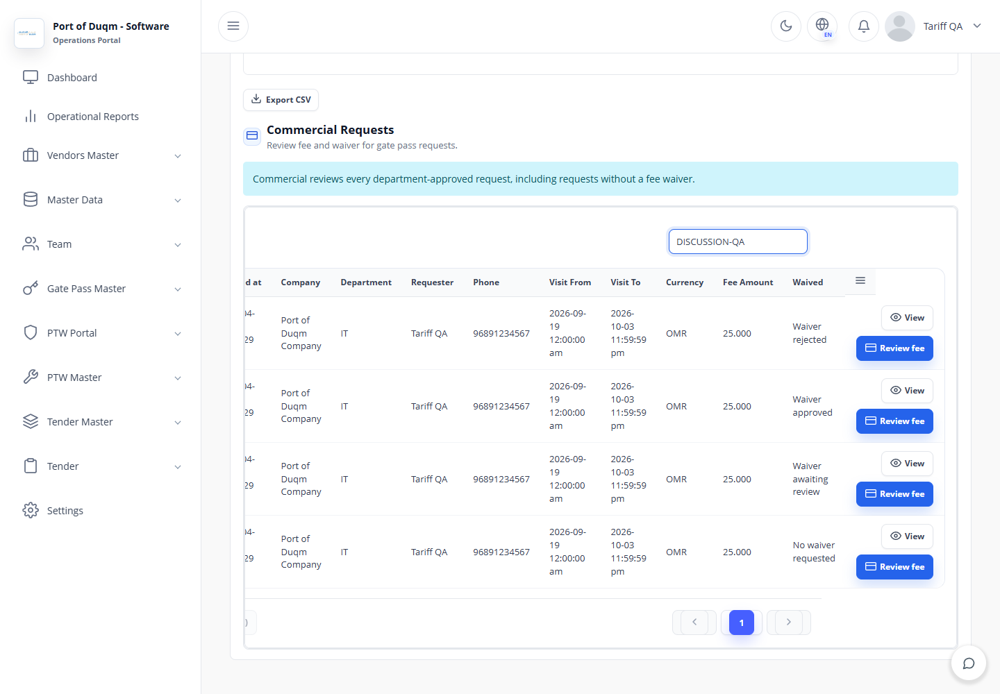
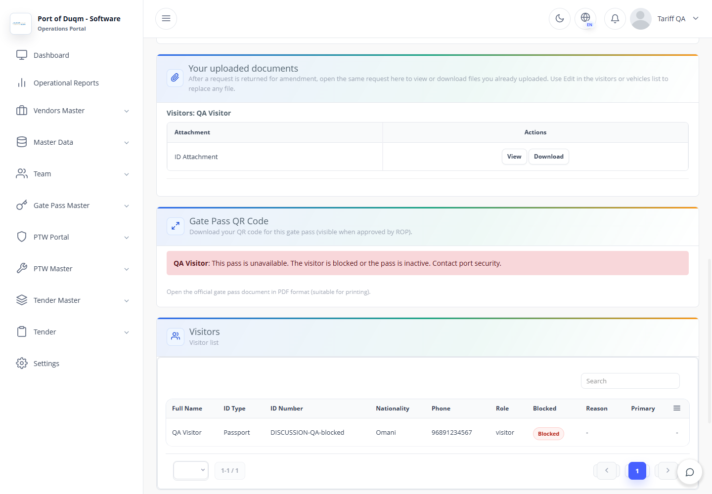

# Gate Pass update QA — 20 September 2026

## Result and scope

Implemented the five agreed discussion items. Commercial still reviews every
department-approved request. HSSE/PDF redesign remains deferred.
This report covers local verification, not live-server acceptance.

The package is cumulative: 47 application files include the previous tariff,
shared-account registration and per-user OTP changes. It does not contain the
whole application, secrets, a database dump or test identities.

## Environment

- PHP 8.2.12, local MySQL/MariaDB; strict SQL mode in the main new database test.
- Disposable databases copied from local schemas; synthetic test transactions.
- Chrome/Playwright; http://127.0.0.1:18084/index.php/.
- Viewports: 1440 × 1000 and 390 × 844; English and Arabic.
- Browser plugin not available; regular Playwright used under the frontend testing skill.
- Email/SMS transports captured or disabled. Local gateway tests use dummy keys.

## Checks

| Check | Result |
|---|---|
| Intended routes and titles load | Pass |
| Meaningful content / no blank page | Pass |
| No framework or PHP error overlay | Pass |
| JavaScript runtime errors | None in the completed browser run |
| Failed page resources | None after correcting the temporary router's static branding-file mapping |
| Waiver filter and counts | Pass: synthetic selection showed none 3, requested 1, approved 1, rejected 1; selecting requested displayed one matching request |
| Actual waiver decisions | Approve advanced to Security; reject stayed payable in Commercial with rejection history; blocked approval refused with byte-identical request row |
| Actual waiver decisions | Approve advanced to Security; reject stayed payable in Commercial with rejection history; blocked approval refused with byte-identical request row |
| Commercial action | Readable View and Review fee buttons; fee dialog opens with expected amount |
| Visitor form | Required ID type/number and new ID attachment; existing uploaded-file link retained on edit |
| International vehicle | Toggle reveals required country and number; Mulkiyah requirement retained |
| Blocked issued pass | Warning replaces QR/download controls; direct QR and PDF requests refuse access |
| Mobile | Navigation transition allowed to finish; form fits width and scrolls; wide report table retains horizontal scrolling |
| Languages | English and Arabic labels rendered; regression checks ensure new OTP/shared-registration labels load too |

Interaction loop: sign in to disposable admin account → Filter Requests → filter
by synthetic visitor ID → select waiver status → verify counts and table rows →
open Commercial Review fee → open visitor and international-vehicle forms →
open a blocked issued pass → verify download controls and endpoint refusals.

## Automated validation

- All 117 existing standalone *Test.php scripts (excluding *DatabaseTest.php) passed.
- GatePassDiscussionDatabaseTest: 81 checks passed.
- GatePassTariffDatabaseTest: 166 checks passed.
- GatePassSharedRegistrationDatabaseTest: 47 checks passed.
- UserOtpDeliveryDatabaseTest: 72 checks passed.
- SmsLoginSettingsDatabaseTest: 27 checks passed.
- GatePassVisitorIdentityFilterDatabaseTest: 27 checks passed.
- Total focused database checks: 420.
- BankMuscatPaymentGatewayTest: 66 behavior checks passed, also included in the standalone suite.
- PHP lint: all 47 changed/new application files passed.
- git diff --check: clean.

The new database checks exercise actual models, SQL and the scan recorder:
normalized-ID blocking, missing identity refusal, attachment retention, atomic
submission/queue rollback, exact department email recipients, delivery deduplication,
blocked approval raw-row equality, stale approval replay, injected SQL failure
rollback, entry refusal for previously printed passes, safe exit, unaffected
visitors, expired/preview/unknown notifications, changed email addresses,
waiver classification, blocked checkout/handoff and late-payment reconciliation.
A simulated verified payment remains paid with review_required while blocked;
after unblock, the same record applies once. No live bank request was sent.

Test adjustments: GatePassParentBindingAuthorizationTest previously required
client-side POST lookup and `allowSubmit = false`. Those two assertions now
verify unconditional server-side refusal and absence of the acknowledgement
bypass. Existing endpoint POST-only, throttling and parent-scope checks remain.
GatePassTariffDatabaseTest adds the real blocked-registry/user/department/outbox
schema dependencies; its original 166 assertions remain unchanged.
Earlier PortalIdentityBoundarySecurityTest edits belong to the shared-account
update and are retained in this working tree.

## Installation and remaining checks

Read GATE_PASS_COMPLETE_UPDATE_README.txt for SQL order and upload instructions.
The new notification table is required before submitting with these PHP files.
The previous fee-waiver enum patch was also found missing locally and installed;
it must exist on the destination if not already installed. Tariff/OTP SQL are
conditional dependencies, not instructions to overwrite customized rates.

No FileZilla or production upload was performed. PHP 8.1/8.3 runtime execution,
production data differences, real SMTP delivery, iSmartSMS handset delivery,
bank connectivity and scheduler installation on the new server remain host
acceptance checks. Existing notification workers process the new queue; failed
or unknown sends are not automatically retried. SQL/log inspection is provided
in the README; this patch does not add a notification-history screen.

## Evidence

The following screenshots use synthetic Gate Pass records:

